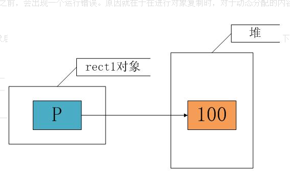

## 1 构造函数

1. 构造函数和析构函数的由来？
2. 构造函数和析构函数的基本语法
3. C++编译器构造析构方案 PK 对象显示初始化方案
4. 构造函数的分类以及调用
5. 默认的构造函数
6. 构造函数调用规则
7. 构造函数和析构函数的总结

------

#### 2.1构造函数和析构函数的由来

类的数据成员不能在类的声明时候初始化,为了解决这个问题? 

使用构造函数处理对对象的初始化。

> **构造函数**是一种特殊的成员函数,与其他函数不同,不需要用户调用它,而是创建对象的时候自动调用。

> **析构函数**是对象不再使用的时候,需要清理资源的时候调用。

------

#### 2.2 构造函数和析构函数的基本语法

a. 构造函数:

> - C++中的类需要定义与类名相同的特殊成员函数时,这种与类名相同的成员函数叫做构造函数;
> - 构造函数可以在定义的时候有参数;
> - 构造函数没有任何返回类型。
> - 构造函数的调用: 一般情况下,C++编译器会自动的调用构造函数。特殊情况下,需要手工的调用构造函数。

```
class Test
{
   public:
   //构造函数
   Test()
   {

   }
} 
```

b. 析构函数:

> - C++中的类可以定义一个特殊的成员函数清理对象,这个特殊的函数是析构函数;
> - 析构函数没有参数和没有任何返回类型;
> - 析构函数在对象销毁的时候自动调用;
> - 析构函数调用机制: C++编译器自动调用。

```
class Test
{
  ~Test()
  {

  }
} 
```

------

#### 2.3C++ 编译器构造析构方案 PK 对象显示初始化方案

```
class Test
{
private:
    int x;
public:
    Test(int x)
    {
        this->x = x;
        cout << "对象被创建" << endl;
    }
    Test()
    {
        x = 0;
        cout << "对象被创建" << endl;
    }
    void init(int x)
    {
        this->x = x;
        cout << "对象被创建" << endl;
    }
    ~Test()
    {
        cout << "对象被释放" << endl;
    }
    int GetX()
    {
        return x;
    }
};

int main()
{
    //1.我们按照C++编译器提供的初始化对象和显示的初始化对象
    Test a(10);
    Test b;      //显示创建对象但是还是调用无参构造函数,之后显示调用了初始化函数
    b.init(10);

    //创建对象数组（使用构造函数）
    Test arr[3] = {Test(10),Test(),Test()};
    //创建对象数组 (使用显示的初始化函数)
    Test brr[3];   //创建了3个对象,默认值
    cout<<brr[0].GetX()<<endl;
    brr[0].init(10);
    cout<<brr[0].GetX()<<endl;
    return 0;
} 
```

根据上面的代码, 我们得出使用显示的初始化方案:

> a.必须为每个类提供一个public的init函数; 
>
> b. 对象创建后必须立即调用init函数进行初始化。

优缺点分析:

- a. init函数只是一个普通的函数,必须显示的调用;
- b. 一旦由于失误的原因,对象没有初始化,那么结果也是不确定的。没有初始化的对象,其内部成员变量的值是不定的;
- c. 不能完全解决问题。

------

#### 2.4构造函数的分类以及调用

a. 无参构造函数

```
class Test
{
  private:
       int x;
  public:
       Test()
       {
         this->x=10;
       }
}12345678910
```

无参构造函数的调用: Test a;

------

b. 有参构造函数

```
class Test
{
  private:
       int x;
  public:
       Test(int x)
       {
         this->x=x;
       }
} 
```

有参数构造函数的调用时机:

- Test a(10); 调用有参数构造函数
- Test b=(2,3); 逗号表达式的值是最后一位,调用有参数构造函数
- Test c=Test(2); 产生一个匿名对象,直接转化成c（只会调用一次有参数构造函数）

------

c. 拷贝构造函数: 使用对象a初始化对象b

```
class Test
{
   private:
          int x;
   public:
          Test(const Test& a)
          {
             this->x=a.x;
          }
} 
```

拷贝构造函数的调用时机:

```
class Test
{
private:
    int x;
public:
    Test(int x)
    {
        this->x = x;
        cout << "对象被创建" << endl;
    }
    Test()
    {
        x = 0;
        cout << "对象被创建" << endl;
    }
    ~Test()
    {
        cout << "对象被释放" << endl;
    }
    Test(const Test& a)
    {
        this->x = a.x;
        cout << "对象被释放（拷贝构造函数）" << endl;
    }
}; 
```

- 第一个场景: 用对象a初始化对象b:

```
Test a(10);
//调用的是拷贝构造函数
Test b = a; 
```

- 第二个场景: 用对象a初始化对象b

```
Test a(10);
//调用的是拷贝构造函数
Test b(a) 
```

第一个场景和第二个场景是一样的,用一个对象初始化另一个对象。

- 第三个场景: 实参初始化形参的时候,会调用拷贝构造函数

```
    Test a(10);
    //实参初始化形参
    PrintF(a); 
```

- 第四个场景: 函数返回一个匿名对象
  我们分析第四个场景前,我们看看下面的这个全局函数:

```
//该函数返回的是谁?
Test p()
{
    Test c(4);
    return c;
} 
```

根据输出结果表明:

函数返回的是一个匿名对象。我们现在可以知道第四个调用场景是函数返回一个匿名对象的时候,会调用拷贝构造函数。
我们接着分析下面的两种情况:(接收匿名对象),判断匿名对象的去和留
a. 匿名对象初始化另一个对象:

```
Test a=p(); 1
```

输出结果:

表明使用匿名对象初始化一个对象的时候, 匿名对象直接转化成初始化的那个对象。
b. 匿名对象赋值时:

```
    Test b;
    //匿名对象赋值另一个对象
    b = p(); 
```

输出结果:

表明使用匿名对象赋值另一个对象的时候,匿名对象赋值以后就会被析构。
匿名对象去和留总结:
a. 匿名对象初始化另一个对象时,匿名对象直接变成有名的对象(初始化的那个对象);
b. 匿名对象赋值另一个对象时,匿名对象赋值成功会被析构。

------

#### 2.5默认的构造函数

两个特殊的构造函数:
a. 默认的无参数构造函数: 当类中没有定义构造函数时,编译器会提供一个无参数构造函数,并且函数体为空;
b. 默认的拷贝构造函数: 当类中没有定义拷贝构造函数时,编译器会提供一个默认的拷贝构造函数,简单的进行成员变量的值复制。

------

#### 2.6 构造函数调用规则

a. 当类中没有定义一个构造函数的时候,C++编译器会提供默认的无参数构造函数和拷贝构造函数;
b. 当类中定义了拷贝构造函数,C++编译器不会提供无参数构造函数;
c. 当类中定义了任意的非拷贝构造函数,C++编译器不会提供默认的无参数构造函数;
d. 默认的拷贝构造函数只是进行成员变量的简单赋值;

------

#### 2.6 构造函数和析构函数的总结

a. 构造函数时C++中用于初始化对象状态的特殊函数;
b. 构造函数在对象创建的时候自动调用;
c. 构造函数和普通成员函数都遵循重载原则;
d. 拷贝构造函数是对象正确初始化的重要保障;
e. 必要的时候必须手工的写拷贝构造函数。

## 3 拷贝构造函数

#### 3.1 什么是拷贝构造函数

首先对于普通类型的对象来说，它们之间的复制是很简单的，例如：

```
int a = 100;
int b = a; 
```

而类对象与普通对象不同，类对象内部结构一般较为复杂，存在各种成员变量。
下面看一个类对象拷贝的简单例子。

```
e std;

class CExample {
private:
    　int a;
public:
      //构造函数
    　CExample(int b)
    　{ a = b;}

      //一般函数
    　void Show ()
    　{
        cout<<a<<endl;
      }
};

int main()
{
    　CExample A(100);
    　CExample B = A; //注意这里的对象初始化要调用拷贝构造函数，而非赋值
    　 B.Show ();
    　return 0;
}
```


运行程序，屏幕输出100。从以上代码的运行结果可以看出，系统为对象 B 分配了内存并完成了与对象 A 的复制过程。就类对象而言，相同类型的类对象是通过拷贝构造函数来完成整个复制过程的。

下面举例说明拷贝构造函数的工作过程。


CExample(const CExample& C)　就是我们自定义的拷贝构造函数。可见，拷贝构造函数是一种 特殊的 构造函数 ，函数的名称必须和类名称一致，它必须的一个参数是本类型的一个**引用变量**。


#### **3.2. 拷贝构造函数的调用时机**

在C++中，下面三种对象需要调用拷贝构造函数！
**1. 对象以值传递的方式传入函数参数**

```
class CExample 
{
private:
 int a;

public:
 //构造函数
 CExample(int b)
 { 
  a = b;
  cout<<"creat: "<<a<<endl;
 }

 //拷贝构造
 CExample(const CExample& C)
 {
  a = C.a;
  cout<<"copy"<<endl;
 }
 
 //析构函数
 ~CExample()
 {
  cout<< "delete: "<<a<<endl;
 }

     void Show ()
 {
         cout<<a<<endl;
     }
};

//全局函数，传入的是对象
void g_Fun(CExample C)
{
 cout<<"test"<<endl;
}

int main()
{
 CExample test(1);
 //传入对象
 g_Fun(test);

 return 0;
}
```


 调用g_Fun()时，会产生以下几个重要步骤：

> (1).test对象传入形参时，会先会产生一个临时变量，就叫 C 吧。
> (2).然后调用拷贝构造函数把test的值给C。 整个这两个步骤有点像：CExample C(test);
> (3).等g_Fun()执行完后, 析构掉 C 对象。

**2. 对象以值传递的方式从函数返回**

```
class CExample 
{
private:
 int a;

public:
 //构造函数
 CExample(int b)
 { 
  a = b;
 }

 //拷贝构造
 CExample(const CExample& C)
 {
  a = C.a;
  cout<<"copy"<<endl;
 }

     void Show ()
     {
         cout<<a<<endl;
     }
};

//全局函数
CExample g_Fun()
{
 CExample temp(0);
 return temp;
}

int main()
{
 g_Fun();
 return 0;
}
```


 当g_Fun()函数执行到return时，会产生以下几个重要步骤：

> (1). 先会产生一个临时变量，就叫XXXX吧。
> (2). 然后调用拷贝构造函数把temp的值给XXXX。整个这两个步骤有点像：CExample XXXX(temp);
> (3). 在函数执行到最后先析构temp局部变量。
> (4). 等g_Fun()执行完后再析构掉XXXX对象。

**3. 对象需要通过另外一个对象进行初始化；
**

后两句都会调用拷贝构造函数。

#### **3.3浅拷贝和深拷贝**

##### 3.3.1默认拷贝构造函数

  很多时候在我们都不知道拷贝构造函数的情况下，传递对象给函数参数或者函数返回对象都能很好的进行，这是因为编译器会给我们自动产生一个拷贝构造函数，这就是“默认拷贝构造函数”，这个构造函数很简单，仅仅使用“老对象”的数据成员的值对“新对象”的数据成员一一进行赋值，它一般具有以下形式：

 
  当然，以上代码不用我们编写，编译器会为我们自动生成。但是如果认为这样就可以解决对象的复制问题，那就错了，让我们来考虑以下一段代码：

　　这段代码对前面的类，加入了一个静态成员，目的是进行计数。在主函数中，首先创建对象rect1，输出此时的对象个数，然后使用rect1复制出对象rect2，再输出此时的对象个数，按照理解，此时应该有两个对象存在，但实际程序运行时，输出的都是1，反应出只有1个对象。此外，在销毁对象时，由于会调用销毁两个对象，类的析构函数会调用两次，此时的计数器将变为负数。

说白了，就是拷贝构造函数没有处理静态数据成员。

出现这些问题最根本就在于在复制对象时，计数器没有递增，我们重新编写拷贝构造函数，如下：

##### **3.3.2. 浅拷贝**

  所谓浅拷贝，指的是在对象复制时，只对对象中的数据成员进行简单的赋值，默认拷贝构造函数执行的也是浅拷贝。大多情况下“浅拷贝”已经能很好地工作了，但是一旦对象存在了动态成员，那么浅拷贝就会出问题了，让我们考虑如下一段代码：

  在这段代码运行结束之前，会出现一个运行错误。原因就在于在进行对象复制时，对于动态分配的内容没有进行正确的操作。我们来分析一下：

  在运行定义rect1对象后，由于在构造函数中有一个动态分配的语句，因此执行后的内存情况大致如下：

 

 

  在使用rect1复制rect2时，由于执行的是浅拷贝，只是将成员的值进行赋值，这时 rect1.p = rect2.p，也即这两个指针指向了堆里的同一个空间，如下图所示：


当然，这不是我们所期望的结果，在销毁对象时，两个对象的析构函数将对同一个内存空间释放两次，这就是错误出现的原因。我们需要的不是两个p有相同的值，而是两个p指向的空间有相同的值，解决办法就是使用“深拷贝”。


**3. 深拷贝**

  在“深拷贝”的情况下，对于对象中动态成员，就不能仅仅简单地赋值了，而应该重新动态分配空间，如上面的例子就应该按照如下的方式进行处理：

此时，在完成对象的复制后，内存的一个大致情况如下：

 

 

此时rect1的p和rect2的p各自指向一段内存空间，但它们指向的空间具有相同的内容，这就是所谓的“深拷贝”。


##### **3.3.3 防止默认拷贝发生**

  通过对对象复制的分析，我们发现对象的复制大多在进行“值传递”时发生，这里有一个小技巧可以防止按值传递——***\*声明一个私有拷贝构造函数\****。甚至不必去定义这个拷贝构造函数，这样因为拷贝构造函数是私有的，如果用户试图按值传递或函数返回该类对象，将得到一个编译错误，从而可以避免按值传递或返回对象。


 拷贝构造函数的几个细节 


##### 3.3.4 拷贝构造函数里能调用private成员变量吗?

解答：**这个问题是在网上见的，当时一下子有点晕。其时从名子我们就知道拷贝构造函数其时就是一个特殊的**构造函数**，操作的还是自己类的成员变量，所以不受private的限制。


##### 3.3.5 以下函数哪个是拷贝构造函数,为什么? 


 解答： 对于一个类X, 如果一个构造函数的第一个参数是下列之一:

```
X&
const X&
volatile X&
const volatile X&
```


且没有其他参数或其他参数都有默认值,那么这个函数是拷贝构造函数.

```
X::X(const X&);  //是拷贝构造函数    
X::X(X&, int=1); //是拷贝构造函数   
X::X(X&, int a=1, int b=2); //当然也是拷贝构造函数
```

**3. 一个类中可以存在多于一个的拷贝构造函数吗?
解答：**类中可以存在超过一个拷贝构造函数。

```
class X { 
public:       
  X(const X&);      // const 的拷贝构造
  X(X&);            // 非const的拷贝构造
};

```

注意,如果一个类中只存在一个参数为 X& 的拷贝构造函数,那么就不能使用const X或volatile X的对象实行拷贝初始化.

```
class X {    
public:
  X();    
  X(X&);
};    

const X cx;    
X x = cx;    // error
	
```

如果一个类中没有定义拷贝构造函数,那么编译器会自动产生一个默认的拷贝构造函数。
这个默认的参数可能为 X::X(const X&)或 X::X(X&),由编译器根据上下文决定选择哪一个。


##  4 explicit关键字 

 

在C++中，我们有时可以将构造函数用作自动类型转换函数。但这种自动特性并非总是合乎要求的，有时会导致意外的类型转换，因此，C++新增了关键字explicit，用于关闭这种自动特性。即被explicit关键字修饰的类构造函数，不能进行自动地隐式类型转换，只能显式地进行类型转换。

注意：只有一个参数的构造函数，或者构造函数有n个参数，但有n-1个参数提供了默认值，这样的情况才能进行类型转换。

下面通过一段代码演示具体应用（无explicit情形）：

[](javascript:void(0);)

```
 1 /* 示例代码1 */
 2 class Demo
 3 {
 4    public:
 5     Demo();    　　　　　　　　　　　　　　   /* 构造函数1 */
 6     Demo(double a);　　　　　　　　　　　　  /* 示例代码2 */
 7     Demo(int a,double b);　　　　　　　　   /* 示例代码3 */
 8     Demo(int a,int b=10,double c=1.6);　　/* 示例代码4 */
 9     ~Demo();
10     void Func(void);
11 
12     private:
13     int value1;
14     int value2;
15 };
```

[](javascript:void(0);)

上述四种构造函数：

构造函数1没有参数，无法进行类型转换！

构造函数2有一个参数，可以进行类型转换，如：Demo test; test = 12.2;这样的调用就相当于把12.2隐式转换为Demo类型。

构造函数3有两个参数，且无默认值，故无法使用类型转换！

构造函数4有3个参数，其中两个参数有默认值，故可以进行隐式转换，如：Demo test;test = 10; 。

 

下面讲述使用了关键字explicit的情况：

[](javascript:void(0);)

```
 /* 示例代码2 */
 class Demo
{
    public:
    Demo();    　　　　　　　　　　　　　　   /* 构造函数1 */
    explicit Demo(double a);　　　　　　　 /* 示例代码2 */
    Demo(int a,double b);　　　　　　　　   /* 示例代码3 */
  
     ~Demo();
     void Func(void);
     private:
     int value1;
     int value2;
};
```

[](javascript:void(0);)

在上述构造函数2中，由于使用了explicit关键字，则无法进行隐式转换。即：Demo test;test = 12.2;是无效的！但是我们可以进行显示类型转换，如：

Demo test;

test = Demo(12.2); 或者

test = (Demo)12.2;


## 5 new 关键字

#### 5.1 C中使用malloc出现的问题

> 1. 程序员必须确定对象的长度
> 2. malloc 返回一个`（void *）`指针 ，c++不允许将`（void*)` 赋值给其它指针，必须强转
> 3. malloc可能申请内存失败，所以必须判断返回值来保存内存分配成功
> 4. 用户在使用对象之前必须记住对他初始化，构造函数不能显示调用初始化（构造函数是由编译器调用的），用户有可能忘记调用初始化函数

c的动态内存分配函数太复杂，容易令人混淆，是不可接受的，c++中我们推荐使用运算符new和delete

#### 5.2 new运算符和delete运算符

> 1. `Person *p=new Person`会返回一个Person
> 2. 默认调用析构函数，开辟空间，返回不是`void*`,不需要强制转换
> 3. delete释放
> 4. new对象用`void *`取接受，释放不了对象
> 5. new出来的是数组，如何释放 ？ delete[]
> 6. new出来的是数组，肯定会调用默认构造


```
     #include<iostream>
     
     using namespace std;
     
     class Person
     {
     public:
     	Person()
     	{
     		cout << "默认构造函数调用" << endl;
     
     	}
     	Person(int a)
     	{
     		cout << "有参构造调用" << endl;
     	}
     
     
     	~Person()
     	{
     		cout << "析构函数调用" << endl;
     	}
     
     };
     
     void test01()
     {
     	//Person p1; //栈区开辟
     
     	Person *p2 = new Person;//堆区开辟
     	//所有new出来的对象，都会返回该类型的指针
     
     	//malloc返回void*还要强转
     	//malloc会调用构造吗？不会 new会调用构造
     	//new运算符，malloc是函数
     	//释放堆区域的空间
     
     	//delete也是运算符，要配合new用，malloc配合free用
     	delete p2;
     }
     void test02()
     {
     	void *p = new Person;
     	//当用void* 接受new出来的指针，会出现释放的问题
     	delete p;
     	//无法释放p
     }
     
     void test03()
     {
     	//同过new来开辟数组
     	//一定会调用默认构造函数,所以一定要提供默认构造
     	Person *pArray = new Person[10];
     
     	//Person pArray2[2] = { Person(1), Person(2) };//在栈上开辟数组，可以指定有参构造
     
     	//释放数组 delete[]必须加上中括号
     	delete []pArray;
     }
     
     
     int main()
     {
     	//test01();
     	//test02();
     	test03();
     	system("pause");
     	return 0;
     }
 
```

#### 5.3 malloc/free和new/delete的区别

malloc/free和new/delete的共同点是：都是从堆上申请空间，并且需要用户手动释放。不同的地方是：

> 1. malloc和free是函数，new和delete是操作符
> 2. malloc申请的空间不会初始化，new可以初始化
> 3. malloc申请空间时，需要手动计算空间大小并传递，new只需在其后跟上空间的类型即可
> 4. malloc的返回值为void*, 在使用时必须强转，new不需要，因为new后跟的是空间的类型
> 5. malloc申请空间失败时，返回的是NULL，因此使用时必须判空，new不需要，但是new需要捕获异常
> 6. 申请自定义类型对象时，malloc/free只会开辟空间，不会调用构造函数与析构函数，而new在申请空间 后会调用构造函数完成对象的初始化，delete在释放空间前会调用析构函数完成空间中资源的清理
> 7. new/delete比malloc和free的效率稍微低点，因为new/delete的底层封装了malloc/free

 

## 6  静态区域

一. 程序内存布局

> 查了相关资料，明白了一点： memory layout of C++/C program is mostly dependent on the Operating System
>
> So it's an opening question ！

即便如此，当清楚C++程序的内存布局后，我们对变量的生存期、内存的管理，将会有更深刻的认识。

 

下面先概括介绍C++程序内存布局，再分别以windows和linux为示例。

#### 6.1C++程序内存布局

对于分段式内存而言，C++程序所涉及的内存区有：**代码段、数据段、堆栈**。（见图）


下面来依次分析C++程序中各个元素所对应的内存位置吧~

> 程序代码：存储在代码段，只读。

变量：

> 根据作用域，可分为：全局变量、局部变量
>
> 根据关键字，有：static静态变量、const常量
>
> 根据位置，有：类变量、函数形参
>
> 特殊变量：字面量